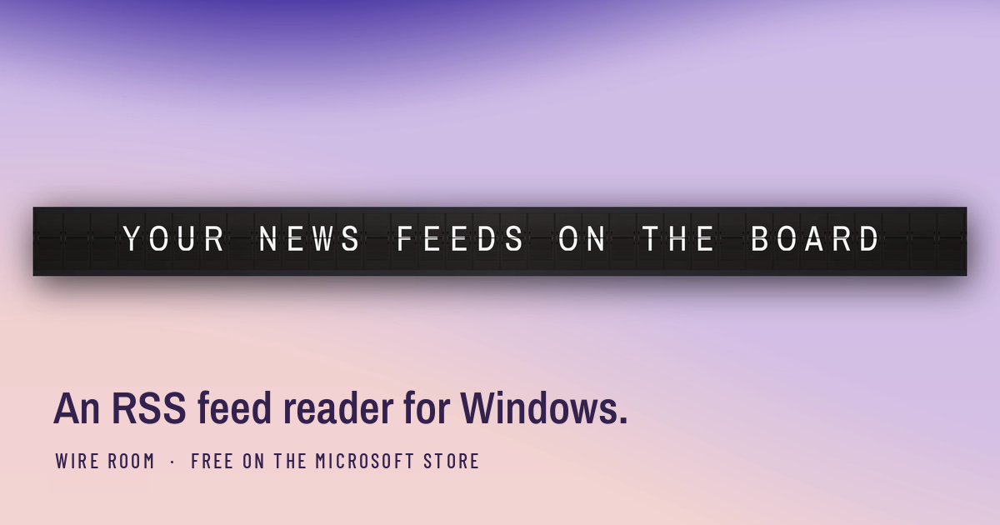

# Wire Room

**An RSS feed reader for Windows.** It runs as a ticker: a thin split-flap or LED
board along the top of your screen. Add the RSS feeds you already read; every headline is scored 1&ndash;10 for
how much it matters, and anything under your threshold never reaches the board.

- **[Get it free on the Microsoft Store](https://apps.microsoft.com/detail/9p5p0f4mwt2f?cid=github-readme)** &middot; Windows 10 and 11
- **[See it moving](https://greendeebie.github.io/wireroom/)** &middot; the site, with the promo and a live board
- **[World news RSS feeds that still work](https://greendeebie.github.io/wireroom/feeds.html)** &middot; twelve addresses to start with, checked October 2026

Two boards &mdash; a split-flap that riffles one story at a time, and an LED matrix that
scrolls them past in six colour schemes &mdash; plus an optional markets panel (gold,
Brent, European gas, wheat, the S&amp;P 500) or world clocks. It ships with no feeds and
no account, and sends nothing anywhere.

---

## About this repository

This is the source of the landing page, not of the app.

Three static pages. No build step, no dependencies, nothing to install.

    index.html      the landing page
    feeds.html      how to add your first feeds
    privacy.html    the privacy policy
    *.png           screenshots, beside the pages
    promo.mp4       the promo, silent, plays in the window under the hero
    promo-poster.jpg  its first frame, shown until playback starts

Everything sits at the top level. GitHub's web uploader flattens dragged folders
without saying so, so a nested `img/` directory silently became three loose files
and every image 404'd. Flat removes the trap.

### Putting it online, free

1. Make a **public** repository on GitHub. Any name; `wireroom` is fine.
2. Upload everything in this folder to the root of it.
3. Repository **Settings → Pages**, set Source to *Deploy from a branch*, branch
   `main`, folder `/ (root)`, save.

A minute or two later it is live at `https://<your-username>.github.io/<repo>/`.

That URL is what goes in the Microsoft Store listing's **Support info**, and it is
what the privacy policy page is for - Partner Center currently holds that text pasted
in by hand, which means it can only be changed by resubmitting the listing.

A custom domain is optional and costs about £10 a year. The github.io address works
and ranks perfectly well for a phrase as specific as "split flap display windows".

### The board on the landing page

It is not a video or a GIF. It is the real mechanism in about sixty lines of
JavaScript: the app's own forty-nine position drum, in the app's own order, turning
forwards only at 55ms a flap with 18ms added per cell. A letter is reached by stepping
through every letter between it and the current one, exactly as the app does and
exactly as the mechanical boards do.

That is the reason it is worth having rather than a recording: a visitor who drags
their eye along it watches the wave cross, which is the thing being sold.

It settles, rests for 2.2 seconds, then turns to the next message. Under
`prefers-reduced-motion` it arrives already settled and changes without animating.

The feed list appears twice: under the video on index.html, with copy buttons, and
in full on feeds.html, which Partner Center's support link points at. Change one,
change both.

The front page's Store links carry campaign IDs (`?cid=site-hero`, `site-bottom`,
`site-feeds`, `github-readme`). Partner Center's Acquisitions report counts page
views and installs per ID, which is how we know what works without putting any
tracking on the site. Use a new ID for every new place the link is posted.

`og-card.png` is the link preview, rebuilt by `store/make-og.py` in the app repo.
The `<hex>.txt` file is the IndexNow key that lets Bing be told about new pages; it
must stay at the top level. "Checked October 2026" on the feeds page is a promise -
re-check the feeds and update the date together.
